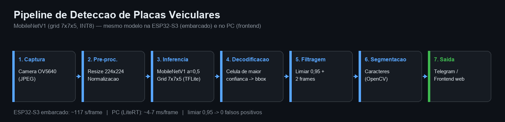
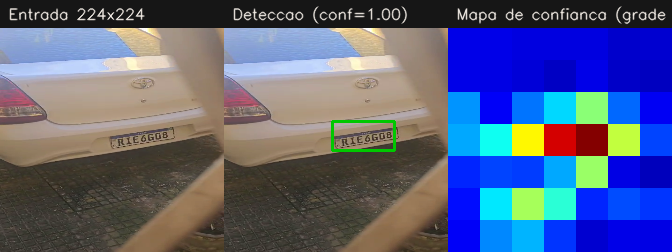
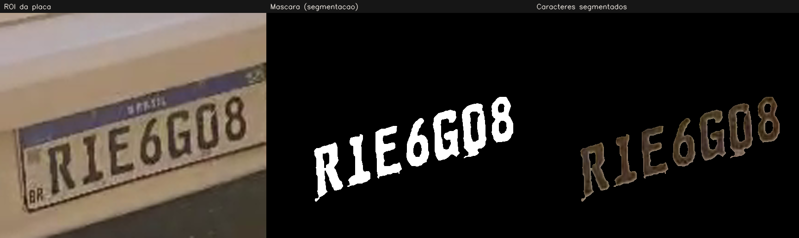

# Detecção de Placas Veiculares com MobileNetV1 embarcado em ESP32-S3

Trabalho final da disciplina **TI0147 — Fundamentos de Processamento Digital de Imagens**
Professor: **Paulo Cesar Cortez**

Sistema completo de **detecção de placas de carro** usando **MobileNetV1** com uma cabeça
de *detector por grade* (saída `7×7×5`), treinado em TensorFlow/Keras, **quantizado em INT8**
e **embarcado em uma ESP32-S3** com câmera OV5640. Inclui pós-processamento (filtragem por
confiança e **segmentação dos caracteres**) e um **frontend** que demonstra as três
modalidades exigidas: **imagem, vídeo e tempo real**.



---

## 👥 Equipe
| Integrante | Frente principal |
|---|---|
| Carlos Vinícius dos Santos Mesquita | Segmentação / relatório / slides |
| Alisson Jaime Sales Barros | Embarcamento na ESP / testes / frontend |
| Victor Guedes Alves Teixeira | Dataset / treino / modelo / segmentação |
| Kaique Ferreira Braga Silva | Firmware / integração / bot Telegram |

---

## 🗂️ Estrutura do repositório
```
.
├── README.md                  ← este arquivo
├── relatorio/                 ← RELATÓRIO FINAL (artigo científico)
│   ├── Relatorio_Final.pdf        ← PDF pronto
│   ├── Relatorio_Final.tex        ← fonte LaTeX (Overleaf-ready)
│   ├── figuras/                   ← figuras do relatório
│   └── gerar_figuras.py           ← gera as figuras automaticamente do vídeo
├── firmware_esp32/            ← CÓDIGO QUE RODA NA ESP (Arduino)
│   ├── Identificador_de_placas/   ← sketch (.ino + modelo .h + partições)
│   └── README.md                  ← como gravar na placa
├── frontend/                 ← APLICAÇÃO DE APRESENTAÇÃO (Python, web local)
│   ├── frontend_apresentacao.py   ← app com 4 abas (imagem/vídeo/tempo real/métricas)
│   ├── modelo_grid_224_alpha_0p5_int8.tflite
│   └── README.md                  ← como rodar
├── modelo_treinamento/       ← TREINO E EXPORTAÇÃO DO MODELO
│   ├── Trabalho_Final_PDI_MobileNetV1_Grid_Detector.ipynb  ← notebook do Colab
│   └── README.md                  ← link do Colab, como treinar/exportar
├── videos_teste/             ← vídeos de teste
├── docs/                     ← enunciado e imagens
│   ├── enunciado_trabalho.pdf
│   └── imagens/
└── _arquivos_antigos/        ← versões antigas (não usadas; mantidas por histórico)
```

---

## 🚀 Início rápido
- **Ler o relatório:** [`relatorio/Relatorio_Final.pdf`](relatorio/Relatorio_Final.pdf)
- **Rodar o frontend (PC):** veja [`frontend/README.md`](frontend/README.md)
  ```bash
  pip install ai-edge-litert opencv-python pillow pyserial numpy
  python frontend/frontend_apresentacao.py
  # abra http://localhost:8000
  ```
- **Gravar na ESP:** veja [`firmware_esp32/README.md`](firmware_esp32/README.md)
- **Treinar/exportar o modelo:** veja [`modelo_treinamento/README.md`](modelo_treinamento/README.md)

---

## 🧠 Como funciona
1. **Captura** — câmera OV5640 fornece um JPEG.
2. **Pré-processamento** — redimensiona para `224×224` e normaliza para `[-1,1]`.
3. **Inferência** — MobileNetV1 (α=0,5) com cabeça de grade `7×7×5`: cada célula prevê
   uma confiança (*objectness*) e a caixa `(cx, cy, w, h)`.
4. **Decodificação** — escolhe a **célula de maior confiança** e reconstrói a *bounding box*.
5. **Filtragem** — só dispara se a confiança ≥ **0,95** por **2 frames** consecutivos.
6. **Segmentação** — isola os caracteres da placa com OpenCV (CLAHE + BlackHat + Otsu).
7. **Saída** — envia a imagem anotada ao **Telegram** (na ESP) ou exibe no **frontend** (PC).

O **mesmo modelo** roda na ESP32-S3 (embarcado, INT8) e no PC (LiteRT), permitindo a
comparação de desempenho exigida no enunciado.

---

## 📊 Resultados (medidos)

**Detecção em imagem** — *bounding box* e mapa de confiança da grade:


**Segmentação dos caracteres** (pós-processamento, OpenCV):


**Métricas em 5 execuções** (média ± desvio):

| Métrica | Base 1 | Base 2 | Mix |
|---|---|---|---|
| IoU médio | 0,768 ± 0,002 | 0,543 ± 0,030 | 0,731 ± 0,005 |
| Recall (IoU≥0,5) | 0,973 | 0,667 | 0,922 |
| F1@0,5 | 0,983 | 0,750 | 0,944 |

**Comparação de plataformas** (mesmo modelo):

| Plataforma | Tempo/inferência | Tamanho |
|---|---|---|
| TFLite INT8 — PC (LiteRT) | ~4–7 ms | 2,35 MB |
| TFLite INT8 — **ESP32-S3** | ~117 s | 2,35 MB |

A quantização INT8 **preservou a qualidade** (IoU ≈ igual ao Keras). O acréscimo de
imagens **negativas** levou os falsos positivos a **0/4** no limiar 0,95. Medições na
ESP: placa real bem enquadrada → **0,98–0,99**; cena sem placa → **0,42–0,58**.

---

## 🔧 Modalidades demonstradas (enunciado)
- **Imagem** — detecção + segmentação sobre imagens estáticas (aba *Imagem* do frontend).
- **Vídeo** — detecção quadro a quadro com FPS (aba *Vídeo*).
- **Tempo real** — câmera OV5640 acoplada à ESP32-S3, inferência embarcada e envio
  automático ao Telegram (aba *Tempo real*).

---

## 🖥️ Hardware e ambiente
- **Placa:** ESP32-S3 (16 MB flash, 8 MB PSRAM OPI, CPU 240 MHz) + câmera **OV5640**.
- **Embarcado:** Arduino-ESP32 3.3.8 / ESP-IDF 5.5, biblioteca `TensorFlowLite_ESP32`.
- **Treino:** Google Colab (TensorFlow 2.20.0, Python 3.12, GPU NVIDIA Tesla T4).
- **Frontend/PC:** Python 3, `ai-edge-litert` + OpenCV.

---

## 📎 Links
- 📓 Notebook de treino (Colab): https://colab.research.google.com/drive/1DE-1luzYAd5wMEtShC5QgKr9YezZuzg7
- 🗃️ Base de dados: *Brazil Plates Detector* (Roboflow, CC BY 4.0)
- 📄 Enunciado: [`docs/enunciado_trabalho.pdf`](docs/enunciado_trabalho.pdf)

